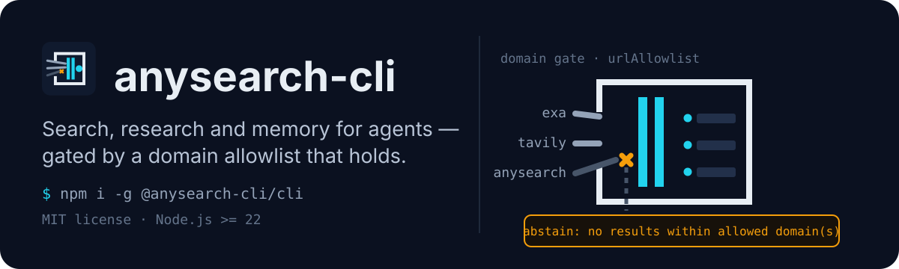
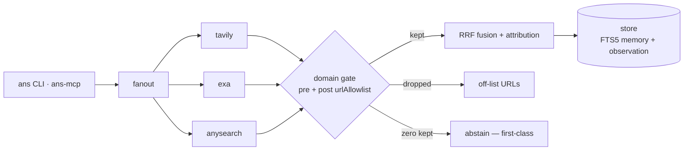

# anysearch-cli

<p align="center">
  
</p>

**English** | [简体中文](README.zh-CN.md)

> This document is canonical; [README.zh-CN.md](README.zh-CN.md) is the derived translation.

[](https://www.npmjs.com/package/@anysearch-cli/cli)
[](https://github.com/Xxx91n/anysearch-cli/actions/workflows/ci.yml)
[](LICENSE)

A vertical-domain information-specialist CLI: search + research + memory +
knowledge in one agent — FTS5 recall, multi-source RRF fusion, an MCP server
that auto-indexes results, and a domain allowlist that actually gates what
comes back.

**Status: published on npm** — `npm i -g @anysearch-cli/cli` (npm OIDC trusted
publishing with sigstore provenance since 0.0.4; 0.0.1/0.0.2 were revoked over
a `workspace:*` peer escape — see CHANGELOG).

What a gated search looks like — every returned URL sits inside the domain's
`urlAllowlist`; an empty gated result is a first-class abstain:

```text
$ ANS_DOMAIN=docs ans search "model context protocol"
1. [tavily] What is the Model Context Protocol (MCP)? - Model Context Protocol
   modelcontextprotocol.io/
2. [exa]
   modelcontextprotocol.io/specification/2026-07-28/basic
3. [exa]
   modelcontextprotocol.io/specification/2026%2D07%2D28
   …

# when the gate leaves zero results — a first-class abstain, not an error:
abstain: no results within allowed cold domain(s) (pre-filtered 0, post-filtered 0, gate pre)
```

## Requirements

- Node.js >= 22 (Node 24 verified)
- pnpm 11.24.0 exactly (pinned; corepack reads `packageManager` automatically)
- At least one provider API key for real searches:
  - `EXA_API_KEY` — Exa (supports domain filtering)
  - `TAVILY_API_KEY` — Tavily (supports domain filtering)
  - `ANYSEARCH_API_KEY` — anysearch REST (optional; anonymous tier works, no domain filter)

## Quickstart

```bash
npm i -g @anysearch-cli/cli
ans doctor                                          # self-check: keys, DB path, domain resolution, provider readiness
ans search "tokio JoinSet rust"                     # first search (full fanout across keyed providers)
ANS_DOMAIN=docs ans search "tokio JoinSet rust"     # domain-scoped search

# optional vector arm (peer-optional — never auto-installed):
npm i -g @anysearch-cli/embedding
```

From source (contributors):

```bash
git clone <this repo> && cd anysearch-cli
pnpm install --node-linker=hoisted   # Windows: hoisted avoids better-sqlite3 EPERM
pnpm build
node apps/cli/dist/index.js doctor
ANS_DOMAIN=docs node apps/cli/dist/index.js search "tokio JoinSet rust"

# machine-readable output (includes sufficiency / attribution / abstain)
node apps/cli/dist/index.js search "..." --json
```

The CLI resolves as `ans` when the package is installed globally or linked; in
repo form, `node apps/cli/dist/index.js` is the same entry point.

## Post-install: vector arm

`@anysearch-cli/embedding` is peer-optional — the CLI runs FTS-only without it.
After a global install (npm or pnpm), verify activation and embed existing rows:

```bash
ans doctor                    # "vector arm (present ...)" confirms activation
ans memory backfill-vectors   # embeds stored rows; first run downloads the model (~130 MB)
```

The model downloads from huggingface.co on first use and is cached at
`~/.anysearch/models` (override: `ANYSEARCH_MODEL_CACHE`). On an offline host,
copy a populated cache dir in from a connected machine. Removing the package
returns the CLI to FTS-only mode — no crash, `ans doctor` reports the arm as
SKIP.

## Domains & abstain (ADR-0062)

A *domain* is a TOML file under `domains/` (or `ANS_DOMAINS_DIR`) naming its
providers and an authoritative `urlAllowlist`. `ANS_DOMAIN` selects it.

Filtering runs as two gates:

1. **Pre-filter (capability-negotiated)** — providers that declare domain-filter
   support receive the allowlist directly (`tavily`: `include_domains` hard
   filter mode; `exa`: `includeDomains`). Providers without support (e.g.
   `anysearch`) degrade honestly to post-filter only — never a faked filter.
2. **Post-filter (authoritative)** — the kernel drops every returned result
   whose URL is not in the allowlist *before* fusion/attribution. Deny rules
   take precedence; allow entries match a host and its subdomains.

When the gate leaves zero results, `ans` **abstains** — a first-class result,
not an error:

```text
abstain: no results within allowed cold domain(s) (pre-filtered 0, post-filtered 0, gate pre)
```

- Exit code **0** by default (abstention is a successful policy outcome);
  `--fail-on-abstain` returns dedicated exit **3** for automation.
- `--json` carries `abstain: { reason, domain, preFiltered, postFiltered, gate }`;
  MCP tools surface `structuredContent.abstain` with `isError: false`.
- Two audit events land in the observation trace per domain-scoped search:
  `retrieval.domain_filter.pre` and `retrieval.domain_filter.post`.

Exit codes: `0` ok/abstain · `1` generic failure or zero results without a
domain policy · `2` usage error · `3` abstain under `--fail-on-abstain`.

## Provider domain-filter matrix

| provider | pre-filter sent | degrade mode |
|----------|-----------------|--------------|
| tavily   | yes (`include_domains`, hard filter mode) | — |
| exa      | yes (`includeDomains`) | — |
| anysearch| no (REST API has no domain parameter) | post-filter only |

Provider selection comes from the domain TOML's `sources.enabled`. Missing
keys skip that provider instead of crashing (fail-open); if *no* provider can
register, the search is an error, not an abstain.

## MCP server

```bash
node apps/mcp/dist/index.cjs                    # stdio transport (default)
node apps/mcp/dist/index.cjs --transport http --port 3099   # HTTP
```

Five tools: `search_web`, `research_web`, `recall_memory`, `query_knowledge`,
`ans_chat`. `ANS_DOMAIN` scopes the server the same way it scopes the CLI.
Tools never print to stdout; the server keeps the protocol channel pure.

## How it works

One pass through the pipeline — providers fan out, the domain gate filters,
results fuse and persist:



## Verified agent hosts

| Host | Version | Verified scope | Status |
|------|---------|----------------|--------|
| CodeBuddy Code | 2.151.0 | `mcp.json` registration + `.codebuddy/settings.json` hooks | live-verified · [doc](docs/codebuddy-integration.md) |
| Claude Code | 2.1.251 | `mcp.json` registration + `.claude/settings.json` hooks + plugin skeleton | live-verified · [doc](docs/claude-integration.md) |
| Codex CLI | 0.142.5 | `config.toml` MCP registration + `.codex/hooks.json` hooks | live-verified · [doc](docs/codex-integration.md) |
| Antigravity CLI (`agy`) | 1.2.5 | named-hook map `hooks.json` (5 events via argv) | live-verified (reduced matrix) · [doc](docs/antigravity-integration.md) |
| Antigravity IDE | 2.12.2 | `.antigravity/rules/anysearch.mdc` fallback | hooks not executed (reproduced) · [doc](docs/antigravity-integration.md) |
| DeepSeek Harness (`dsh`) | 0.1.5-rc.2 | MCP bridge patch + `dsh-plugin` Cordis bundle | live-verified (headless + web profile) · [doc](docs/deepseek-harness-integration.md) |

"Verified" means an end-to-end transcript captured on the real host
(`stream-json`), not contract isomorphism — full scope, dates and probe
evidence live in the linked integration docs. ADR-0066 / ADR-0067 /
ADR-0068 / ADR-0069 / ADR-0073 carry the evidence sets.

## Known limitations

| Limitation | Why it matters |
|------------|----------------|
| macOS is outside the blocking matrix | an unresolved exit-time `libc++abi` crash keeps `ship-gate` gated on ubuntu+windows; macOS runs as a non-blocking probe lane |
| `anysearch` provider cannot pre-filter | its REST surface has no domain parameter — under a domain allowlist it degrades honestly to post-filter only |
| exit-time `libc++abi` may overwrite the abstain exit code | automation must read the structured abstain marker (`--json` / `structuredContent.abstain`), not the exit code alone |

Full record: [docs/limitations.md](docs/limitations.md).

## Design rationale

- **Vertical-domain** — domains are TOML policy files with an authoritative
  `urlAllowlist` enforced in the kernel, not prompt wishes.
- **Abstain-first** — an empty gated result is a first-class abstain, never a
  hallucinated answer.
- **Fail-open** — hooks, providers and optional peers degrade honestly instead
  of breaking the host agent.

The complete numbered record: [docs/adr/index.md](docs/adr/index.md).

## For contributors

- `CONTEXT.md` — canonical domain glossary (read first)
- `docs/adr/index.md` — generated decision index (`scripts/gen-adr-index.mjs`, do not edit by hand)
- `docs/limitations.md` — full known-limitations record
- `docs/agents/` — domain-doc + local-markdown issue tracker conventions
- Repo layout: `packages/kernel` (engine) · `packages/store` (FTS5 memory,
  observation, URL policy) · `packages/retriever` (provider adapters + RRF) ·
  `apps/cli` · `apps/mcp` · `apps/plugin` (host hooks)
- Per-package tests run under `node --import tsx --test`; the full gate is
  `node scripts/ship-gate.mjs` (clean tree, tests, pack, install verify, MCP
  initialize, fail-open boot)
- Governance: `docs/ponytail-debt-ledger.md`, `.scratch/<slug>/`, `AGENTS.md`
